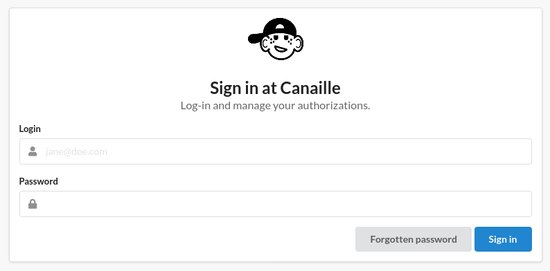
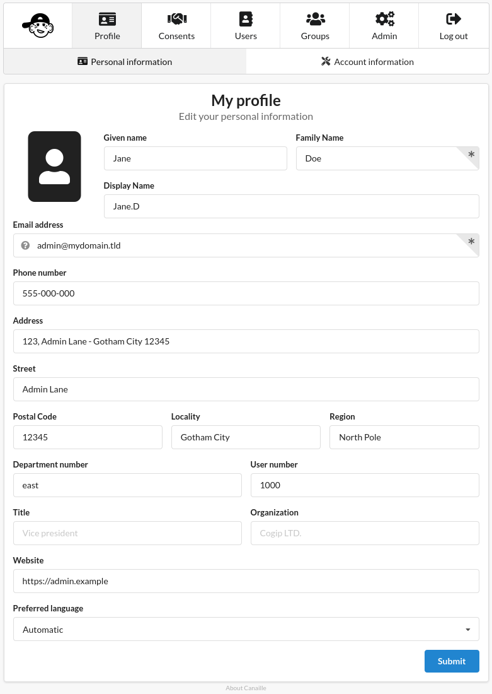
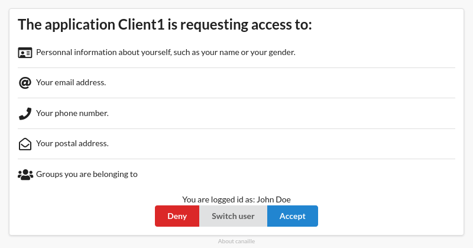

<div align="center">
    
</div>

**Canaille** is a French word meaning *rascal*. It is roughly pronounced **Can I?**,
as in *Can I access your data?* Canaille is a simple account manager and an OpenID Connect provider based upon a LDAP database.

It aims to be very light, simple to install and simple to maintain. Its main features are :
- Authentication and user profile edition against a LDAP directory;
- "I forgot my password" emails;
- Only OpenID Connect: no outdated or exotic protocol support;
- No additional database required: everything is stored in your LDAP server;
- Customizable, themable;
- The code is easy to read and easy to edit, and you should!

# Screenshots

<div align="center">
    
    
    
</div>

# Try it!

```bash
cd demo
./run.sh # or `docker-compose up` to run it with docker
```

or try our [online demo](https://demo.canaille.yaal.coop)!

You have access to:
- a canaille server at [https://demo.canaille.yaal.coop](https://demo.canaille.yaal.coop)
- a dummy client at [https://demo.client1.yaal.coop](https://demo.client1.yaal.coop)
- another dummy client at [https://demo.client2.yaal.coop](https://demo.client2.yaal.coop)

The canaille server has some default users:
- A regular user which login and password are **user**
- A moderator user which login and password are **moderator**
- An admin user which login and password are **admin**

Online demo data are reset every night at 02:00 CEST.

# Documentation

⚠ Canaille is under heavy development and may not fit a production environment yet. However, [contributions](CONTRIBUTING.rst) are welcome! ⚠

- Please have a look on our [documentation](https://canaille.readthedocs.io);
- To **install** canaille, just follow the [installation guide](https://canaille.readthedocs.io/en/latest/install.html);
- To **contribute** to canaille, please read the [contribution guide](https://canaille.readthedocs.io/en/latest/contributing.html).
