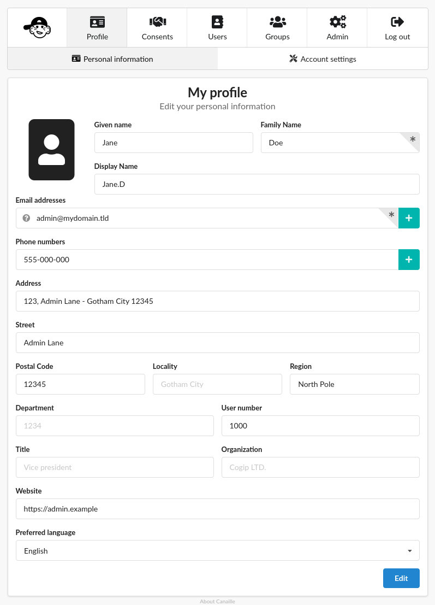
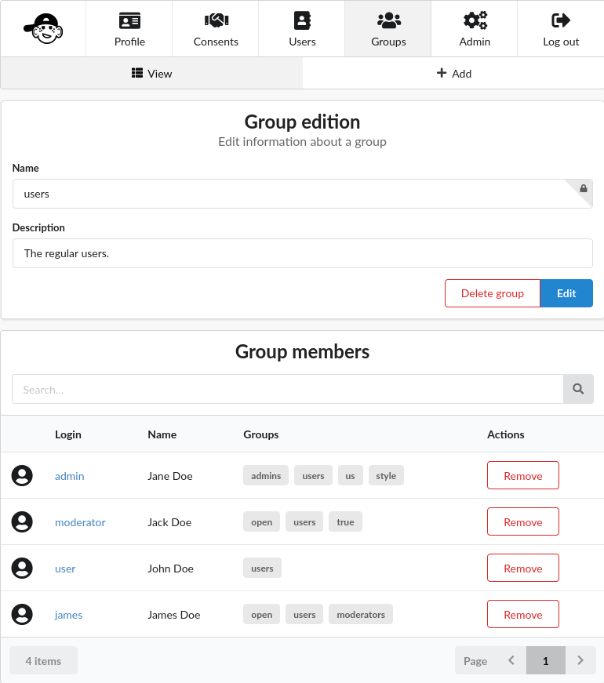
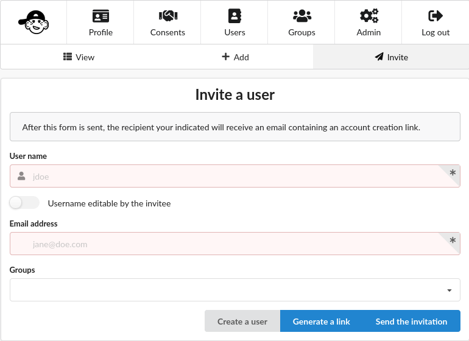
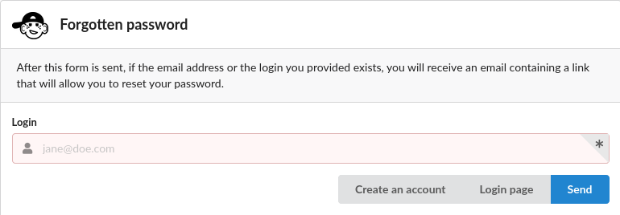
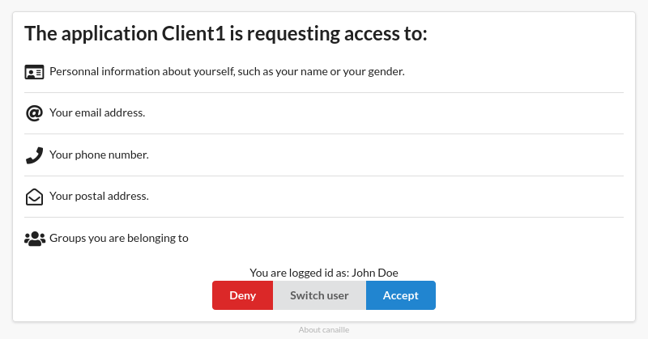

.. This page should list the functional perimiter of Canaille,
   without mentioning too much technical details. We should avoid giving
   explicit configuration parameters for instance. However, we should put as
   much links to other sections of the documentation as possible.

   TODO: replace 'users with user management permission' by 'administrators'?

Features
########

Here are the different features that Canaille provides.
You can enable any of those features with the :doc:`configuration <references/configuration>` to fit any :doc:`use cases <usecases>` you may meet.
Check our  :ref:`roadmap <features:Roadmap>` to see what is coming next.

Users can interact with Canaille through its :ref:`web interface <features:Web interface>` and administrators can also use its :ref:`command line interface <feature_cli>`.
Canaille can handle data stored in different :ref:`database backends <feature_databases>`.

User and group management
*************************

Canaille web interface can be used either in :doc:`production environments <tutorial/deployment>` or locally for development purposes.

.. _feature_profile_management:

Profile management
==================

Canaille provides an interface to manage user profiles.

The exact list of displayed fields, and whether they are :attr:`writable <canaille.core.configuration.ACLSettings.WRITE>` or :attr:`read-only <canaille.core.configuration.ACLSettings.READ>` depends on the user :class:`Access Control List settings (ACL) <canaille.core.configuration.ACLSettings>`.

Depending on their ACL :class:`permissions <canaille.core.configuration.Permission>`, users can either be allowed to edit their own profile, edit any user profile, or do nothing at all.

.. _feature_email_confirmation:

Email confirmation
==================

If the :attr:`email confirmation feature <canaille.core.configuration.CoreSettings.EMAIL_CONFIRMATION>` is enabled, any modification or addition of a profile email will send a confirmation mail to the new address. The mail will contain a link that users will need to click on to confirm their email address.

Users with :attr:`user management permission <canaille.core.configuration.Permission.MANAGE_USERS>` can set user emails without confirmation though.

.. _feature_group_management:

Group management
================

In a similar fashion than :ref:`profile management <feature_profile_management>` Canaille provides an interface to manage user groups.

The group management is quite simple at the moment and consists in a group name and description, and the list of its members.
Group membership can be use as :attr:`ACL Filter <canaille.core.configuration.ACLSettings.FILTER>` to define user permissions.

.. todo::
   At the moment adding an user to a group can only be achieved by the user settings page, but we are :issue:`working to improve this <192>`.

Group management can be enable with a :attr:`dedicated user permission <canaille.core.configuration.Permission.MANAGE_GROUPS>`.

.. important::
   Due to limitations in the :ref:`LDAP backend <tutorial/databases:LDAP>`, groups must have at least one member.
   Thus it is not possible to remove the last user of a group without removing the group.

.. _feature_user_authentication:

User authentication
===================

Unless their account is :ref:`locked <feature_account_locking>`, users can authenticate with a login and a password.

.. important::

   For security reasons, it won't be told to users if they try to sign in with an unexisting logging, unless explicitly :attr:`set in the configuration <canaille.core.configuration.CoreSettings.HIDE_INVALID_LOGINS>`.

.. todo:: :ref:`LDAP backend <tutorial/databases:LDAP>` users can define which :class:`user field <canaille.core.models.User>` should be used as the login (such as :attr:`~canaille.core.models.User.user_name` or :attr:`~canaille.core.models.User.emails`) using a :attr:`configuration parameter <canaille.backends.ldap.configuration.LDAPSettings.USER_FILTER>`, but other backends can only login using :attr:`~canaille.core.models.User.user_name`. We are :issue:`working to improve this <196>`.

.. _feature_user_registration:

User registration
=================

Users can create accounts on Canaille if the :attr:`registration feature <canaille.core.configuration.CoreSettings.ENABLE_REGISTRATION>` is enabled. They will be able to fill a registration form with the fields detailed in the default :class:`ACL settings <canaille.core.configuration.ACLSettings>`.

If :attr:`email confirmation <canaille.core.configuration.CoreSettings.EMAIL_CONFIRMATION>` is also enabled, users will be sent a confirmation link to their email address, on which they will need to click in order to finalize their registration.

.. _feature_user_invitation:

User invitation
===============

If a :class:`mail server <canaille.core.configuration.SMTPSettings>` is configured, users with :attr:`user management permission <canaille.core.configuration.Permission.MANAGE_USERS>` can create an invitation link for one user.

The link goes to a registration form, even if regular :ref:`user registration <feature_user_registration>` is disabled.

It can be automatically sent by email to the new user.

.. _feature_account_locking:

Account locking
===============

If Canaille is plugged to a :ref:`backend <feature_databases>` that supports it, user accounts can be locked by users with :attr:`user management permission <canaille.core.configuration.Permission.MANAGE_USERS>`.
The lock date can be set instantly or at a given date in the future.

At the moment a user account is locked:

- their open sessions will be closed;
- they won't be able to sign in again;
- no new OIDC token will be issued;

User accounts must be manually unlocked by an administrator for the users to regain access to those actions.

.. _feature_account_deletion:

Account deletion
================

Users with the :attr:`account deletion permission <canaille.core.configuration.Permission.DELETE_ACCOUNT>` are allowed to delete their own account.

Users that also have the :attr:`user management permission <canaille.core.configuration.Permission.MANAGE_USERS>` are also allowed to delete other users accounts.

.. _feature_password_recovery:

Password recovery
=================

If a :class:`mail server <canaille.core.configuration.SMTPSettings>` is configured and the :attr:`password recovery feature <canaille.core.configuration.CoreSettings.ENABLE_PASSWORD_RECOVERY>` is enabled, then users can ask for a password reset email if they cannot remember their password.

The email will be sent to the email addresses filled in their profile, and will contain a link that will allow them to choose a new password. .

.. todo::

    Check that password recovery is disabled on locked accounts.

.. _feature_password_reset:

Password reset
==============

If a :class:`mail server <canaille.core.configuration.SMTPSettings>` is configured, :attr:`user management permission <canaille.core.configuration.Permission.MANAGE_USERS>` can send password reset mails to users.
The mails contains a link that allow users to choose a new password without having to retrieve the old one.

.. _feature_password_initialization:

Password initialization
=======================

User :attr:`passwords <canaille.core.models.User.password>` are optional.
If a :class:`mail server <canaille.core.configuration.SMTPSettings>` is configured, when users with no password attempt to sign in, they are invited to click a button that will send them a password initialization mail.
The mail contains a link that leads to a form that allows users to choose a password.

.. _feature_password_compromission_check:

Password compromission check
============================

If :attr:`password compromission check feature <canaille.core.configuration.CoreSettings.ENABLE_PASSWORD_COMPROMISSION_CHECK>` is enabled, Canaille will check for password compromise on HIBP (https://haveibeenpwned.com/) every time a new password is register. You will need to set an :attr:`admin email <canaille.core.configuration.CoreSettings.ADMIN_EMAIL>`.

.. _feature_multi_factor_authentication:

Multi-factor authentication
===========================

If the :attr:`one-time password feature <canaille.core.configuration.CoreSettings.OTP_METHOD>` is set, then users will need to authenticate themselves using a one-time password via an authenticator app.
Two options are supported : "TOTP" for time one-time password, and "HOTP" for HMAC-based one-time password.
In case of lost token, TOTP/HOTP authentication can be reset by users with :attr:`user management permission <canaille.core.configuration.Permission.MANAGE_USERS>`.
If a :class:`mail server <canaille.core.configuration.SMTPSettings>` is configured and the :attr:`email one-time password feature <canaille.core.configuration.CoreSettings.EMAIL_OTP>` is enabled, then users will need to authenticate themselves via a one-time password sent to their primary email address.
If a :class:`smpp server <canaille.core.configuration.SMPPSettings>` is configured and the :attr:`sms one-time password feature <canaille.core.configuration.CoreSettings.SMS_OTP>` is enabled, then users will need to authenticate themselves via a one-time password sent to their primary phone number.

.. _feature_intruder_lockout:

Intruder lockout
================

If the :attr:`intruder lockout feature <canaille.core.configuration.CoreSettings.ENABLE_INTRUDER_LOCKOUT>` is enabled, then users will have to wait for an increasingly long time between each failed login attempt.

Web interface
*************

.. _feature_i18n:

Internationalization
====================

.. image:: https://hosted.weblate.org/widgets/canaille/-/canaille/multi-blue.svg
   :alt: Translation state
   :align: right
   :width: 600px

Canaile will display in your :attr:`preferred language <canaille.core.models.User.preferred_language>` if available, or your browser language if available (and if it is not you can :ref:`help us with the translation <development/contributing:Code translation>`).
If you prefer, you can also :attr:`force a language <canaille.core.configuration.CoreSettings.FAVICON>` for every users.

.. _feature_ui:

Lightweight
===========

The web interface is lightweight, so everything should load quickly.
There is a few Javascript here and there to smooth the experience, but no Javascript at all is needed to use Canaille.

Customizable
============

The default theme should be good enough for most usages.
It has a dark theme, display well on mobile, and let you choose a :attr:`logo <canaille.core.configuration.CoreSettings.LOGO>` and a :attr:`favicon <canaille.core.configuration.CoreSettings.FAVICON>`.

If you need more you can also use a :attr:`custom theme <canaille.core.configuration.CoreSettings.THEME>`.

.. _feature_oidc:

OpenID Connect
**************

Canaille implements a :ref:`subset<development/specifications:State of the specs in Canaille>` of the OAuth2/OpenID Connect specifications .
This allows to provide :abbr:`SSO (Single Sign-On)` and :abbr:`SLO (Single Log-On)` to applications plugged to Canaille.

Consent management
==================

Users can give their consent to application requesting access to their personal information,
and then revoke those consent at their will.

Application management
======================

Users with the right :attr:`permission <canaille.core.configuration.Permission.MANAGE_OIDC>` can manager OIDC clients through the web interface.

In some cases, it might be useful to avoid the consent page for some trusted applications, so clients can be pre-consented.

Discovery
=========

Canaille implements the :doc:`Discovery specifications <development/specifications>` so most of the applications plugged to Canaille can auto-configure themselves.

Dynamic Client Registration
===========================

Canaille implements the :doc:`Dynamic Client Registration specifications <development/specifications>`, so when the :attr:`feature is enabled <canaille.oidc.configuration.OIDCSettings.DYNAMIC_CLIENT_REGISTRATION_OPEN>`, clients can register themselves on Canaille without an administrator intervention.

System administration
*********************

.. _feature_cli:

Command Line Interface
======================

Canaille comes with a :abbr:`CLI (Command Line Interface)` to help administrators in hosting and management.

There are tools to :ref:`check your configuration <cli_check>` or to :ref:`install missing parts <cli_install>`.
You can use the CLI to :ref:`create <cli_create>`, :ref:`read <cli_get>`, :ref:`update <cli_set>` and :ref:`delete <cli_delete>` models such as :class:`users <canaille.core.models.User>`, :class:`groups <canaille.core.models.Group>` or  :class:`OIDC clients <canaille.oidc.basemodels.Client>`.

There are also tools to :ref:`fill your database <cli_populate>` with random objects, for tests purpose for instance.

.. _feature_databases:

Databases
=========

Canaille can handle data from the most :ref:`common SQL databases <tutorial/databases:SQL>` such as PostgreSQL, MariaDB or SQLite, as well as :ref:`OpenLDAP <tutorial/databases:LDAP>`.
It also comes with a no-dependency :ref:`in-memory database <tutorial/databases:Memory>` that can be used in unit tests suites.

.. _feature_logging:

Logging
=======

Canaille writes :attr:`logs <canaille.core.configuration.CoreSettings.LOGGING>` for every important event happening, to help administrators understand what is going on and debug funky situations.

The following security events are logged with the log level "security" for easy retrieval :

- Authentication attempt
- Password update
- Email update
- Forgotten password mail sent to user
- One-time password mail sent to user
- Multi-factor authentication reset
- Token emission
- Token refresh
- Token revokation
- New consent given for client application
- Consent revokation

.. _feature_development:

Development and testing tool
****************************

.. _feature_testing:

Unit-testing tool
=================

Thanks to its lightweight :ref:`in-memory database <tutorial/databases:Memory>` and its curated :ref:`dependency list <tutorial/install:Get the code>`, Canaille can be used in the unit test suite of your application, so you can check how it behaves against a real world OpenID Connect server. If you work with python you might want to check :doc:`pytest-iam:index`.

Development server
==================

It can also being launched in your development environment, if you find that launching a Keycloak in a Docker container is too heavy for your little web application.

.. _feature_ci:

Continuous Integration tools
============================

It also fits well in continuous integration scenarios. Thanks to its :ref:`CLI <feature_cli>`, you can prepare data in Canaille, let your application interact with it, and then check the side effects.

Roadmap
*******

Bêta version
============

To go out of the current Alpha version we want to achieve the following tasks:

- :issue:`Configuration validation using pydantic <138>`

Stable version
==============

Before we push Canaille in stable version we want to achieve the following tasks:

Security
--------

- :issue:`Password hashing configuration <175>`
- :issue:`Authentication logging policy <177>`
- :issue:`Intruder lockout <173>`
- :issue:`Password expiry policy <176>`
- :issue:`Multi-factor authentication: Email <47>`
- :issue:`Multi-factor authentication: SMS <47>`
- :issue:`Multi-factor authentication: OTP <47>`

Packaging
---------

- :issue:`Nix package <190>`
- :issue:`Docker / OCI package <59>`

And beyond
==========

- :issue:`OpenID Connect certification <182>`
- :issue:`SCIM support <116>`
