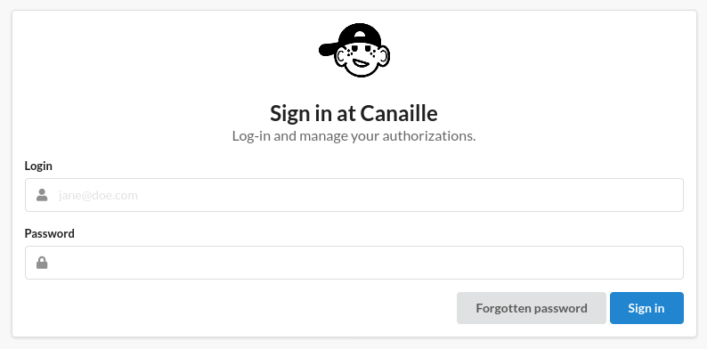

.. figure:: _static/canaille-full-black.webp
  :width: 400
  :figclass: light-only
  :align: center

.. figure:: _static/canaille-full-white.webp
  :width: 400
  :figclass: dark-only
  :align: center

**Canaille** is a French word meaning *rascal*. It is roughly pronounced **Can I?**,
as in *Can I access your data?* Canaille is a lightweight identity and authorization management software.

It aims to be very light, simple to install and simple to maintain. Its main features are :

- User profile and groups management;
- Authentication, registration, email confirmation, "I forgot my password" emails;
- OpenID Connect identity provider;
- postgresql, mariadb and OpenLDAP first-class citizenship;
- Customizable, themable;
- The code is easy to read and easy to edit!

Screenshots
===========

.. image:: _static/profile.webp
  :width: 225
  :alt: Profile

.. image:: _static/consent.webp
  :width: 225
  :alt: Consent

Table of contents
=================

.. toctree::
   :maxdepth: 2

   install
   deployment
   databases
   configuration
   troubleshooting
   contributing
   reference
   specifications
   changelog

Indices and tables
==================

* :ref:`genindex`
* :ref:`modindex`
* :ref:`search`
